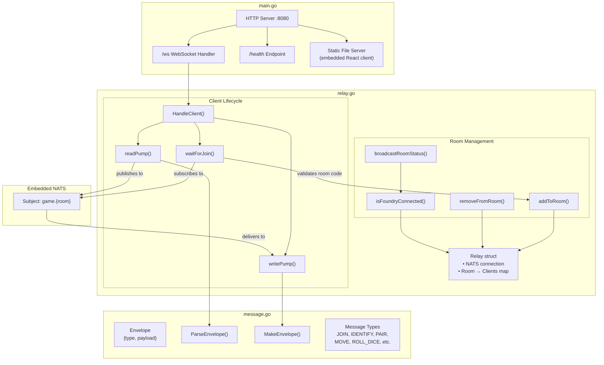
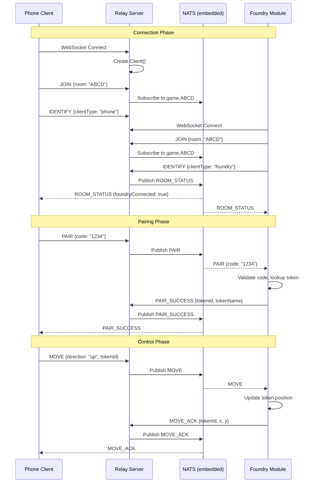

# VTT Remote

A remote control system for Foundry Virtual Tabletop. Players connect their phones to control tokens on the battle map - movement, dice rolling, and quick actions.

## What This Does

You run a relay server. Foundry VTT connects to it. Phones connect to it. Messages flow between them. A player picks up their phone, enters a room code, pairs with a token, and suddenly they have a D-pad to move their character around while watching the big screen.

## Architecture

```
┌──────────────────────────────────────────────────────────────────┐
│                      RELAY SERVER (Go)                           |
│                                                                  │
│  ┌────────────────┐    ┌────────────────┐    ┌───────────────┐   │
│  │   HTTP Server  │    │   WebSocket    │    │ Embedded NATS |   │
│  │  (static files) │    │   /ws endpoint │    |   (pub/sub)   │   │
│  └────────────────┘    └────────────────┘    └───────────────┘   │
│                              │                       │           │
│                              └───────────────────────┘           │
│                              Clients subscribe to game.{room}    │
└──────────────────────────────────────────────────────────────────┘
                    │                              │
                    ▼                              ▼
         ┌──────────────────┐           ┌──────────────────┐
         │   Phone Client   │           │  Foundry Module  │
         │     (React)      │           │   (TypeScript)   │
         │                  │           │                  │
         │ • Auth/Pairing   │           │ • Token control  │
         │ • D-Pad movement │           │ • Dice rolling   │
         │ • Dice roller    │           │ • Actor data     │
         │ • Actor info     │           │ • Pairing codes  │
         │ • Quick actions  │           │                  │
         └──────────────────┘           └──────────────────┘
```

## Components

### Relay Server (`/server`)

Go application that bridges WebSocket clients with NATS pub/sub messaging. No external dependencies - NATS runs embedded.

**Files:**
- `main.go` - HTTP server, WebSocket upgrade, embedded NATS bootstrap, static file serving
- `relay.go` - Client/room management, message routing, subscription handling
- `message.go` - Protocol definitions (message types and payloads)

**How it works:**

1. Client connects to `/ws`
2. Client sends `JOIN` with a room code (4-8 alphanumeric chars)
3. Server subscribes client to NATS subject `game.{roomCode}`
4. Messages published to that subject get forwarded to all clients in the room
5. Server tracks client types (Foundry vs phone) and broadcasts room status changes

The server handles slow clients by dropping messages when the send buffer fills up. No blocking.

```
server/
├── main.go           # Entry point, HTTP/WS setup
├── relay.go          # Client management, NATS bridging
├── message.go        # Protocol types
├── relay_test.go     # Tests
├── message_test.go   # Tests
└── public/           # Embedded React client (built)
```

### Phone Client (`/client-react`)

React application that runs in a phone browser. Built with Vite, styled with Tailwind.

**Screens:**
- Auth - Enter room code, login or pair with a token
- Token Picker - Select which token to control (if multiple available)
- Control - D-pad, dice roller, actor info, quick actions

**State management:** Single Zustand store handles WebSocket connection, reconnection with exponential backoff, auth state, and actor data.

**Features:**
- Haptic feedback on dice rolls (vibration on success/failure)
- Theme picker (Terminal, Synthwave, Solarized, etc.)
- Throttled movement (150ms) to prevent spam
- Password hashing client-side with SHA-256

```
client-react/
├── src/
│   ├── App.tsx           # Screen router
│   ├── stores/gameStore.ts    # All state management
│   ├── screens/          # Auth, TokenPicker, Control
│   ├── components/       # DPad, DiceRoller, ActorInfo, etc.
│   └── types/            # TypeScript definitions
├── vite.config.ts
└── package.json
```

### Foundry Module (`/foundry-module`)

TypeScript module that runs inside Foundry VTT. Handles the game-side logic.

**Responsibilities:**
- Generate pairing codes for tokens (4-digit, 5-minute TTL)
- Process movement commands (convert direction to grid position)
- Execute dice rolls and post results to chat
- Stream actor data (health, stats, conditions, abilities) to connected phones
- Password-based login with session tokens

**Architecture:** Clean separation between imperative shell (Foundry APIs, WebSocket, DOM) and pure core functions (pairing, movement, auth). Core functions are tested independently of Foundry.

```
foundry-module/
├── src/
│   ├── main.ts           # Foundry hooks, WebSocket, imperative shell
│   └── core/             # Pure functions (testable without Foundry)
│       ├── messages.ts   # Parse/build protocol messages
│       ├── pairing.ts    # Session management
│       ├── movement.ts   # Direction to position
│       └── auth.ts       # Password/token validation
├── module.json           # Foundry metadata
└── package.json
```

## Message Protocol

All messages are JSON over WebSocket:

```json
{ "type": "MESSAGE_TYPE", "payload": {...} }
```

**Connection flow:**

```
Phone                    Server                   Foundry
  │                        │                        │
  │──── JOIN {room} ──────▶│                        │
  │                        │◀─── JOIN {room} ───────│
  │                        │                        │
  │── IDENTIFY {phone} ───▶│                        │
  │                        │◀─ IDENTIFY {foundry} ──│
  │                        │                        │
  │◀── ROOM_STATUS ────────│─── ROOM_STATUS ───────▶│
  │                        │                        │
  │──── PAIR {code} ──────▶│──── PAIR {code} ──────▶│
  │                        │                        │
  │◀── PAIR_SUCCESS ───────│◀── PAIR_SUCCESS ───────│
  │                        │                        │
  │──── MOVE {dir} ───────▶│──── MOVE {dir} ───────▶│
  │                        │                        │
  │◀── MOVE_ACK {x,y} ─────│◀── MOVE_ACK {x,y} ─────│
```

**Message types:**
- `JOIN` / `IDENTIFY` - Connection setup
- `ROOM_STATUS` - Foundry connection state
- `PAIR` / `PAIR_SUCCESS` / `PAIR_FAILED` - Token pairing
- `MOVE` / `MOVE_ACK` - Token movement
- `ROLL_DICE` / `ROLL_DICE_RESULT` - Dice rolling
- `LOGIN` / `LOGIN_SUCCESS` - Password auth
- `ACTOR_INFO` / `ACTOR_UPDATE` - Character data streaming
- `USE_ABILITY` / `USE_ABILITY_RESULT` - Quick actions

## Server Internals (Mermaid)



## Message Flow Detail



## Building

Requires Go 1.24+, Node.js 20+, and [Task](https://taskfile.dev/).

```bash
# Build everything
task

# Or build individual components
task build:client   # React app
task build:module   # Foundry module
task build:server   # Go binary (embeds client)
```

## Development

```bash
# Run Go server (serves built client)
task dev:server

# Run React dev server with HMR (separate terminal)
task dev:client

# Watch and rebuild Foundry module
task dev:module
```

## Testing

```bash
task test:server    # Go tests with race detector
task test:module    # Foundry module unit tests
```


## License

MIT
